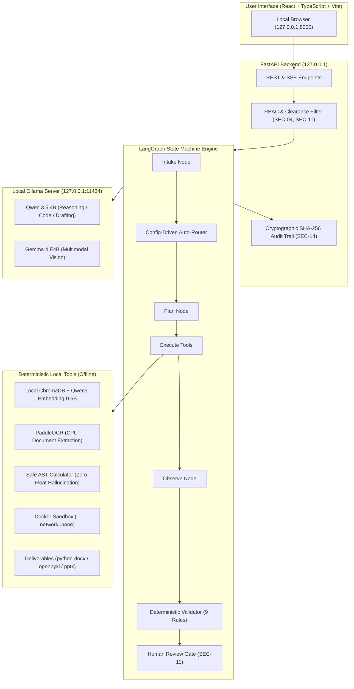

# Sovereign AI Workbench

[](#air-gap--sovereignty-guarantees)
[](#architecture)
[](docs/evidence/eval_report.md)
[](scripts/scan_egress.py)

**Sovereign AI Workbench** is an air-gapped, self-hosted, agentic AI workbench built for confidential industrial, critical infrastructure, and government knowledge work. It operates entirely on a single local workstation with **zero internet connectivity** required after installation.

Two open-weight models are served locally via **Ollama**:
1. **Qwen 3.5 4B** (`qwen3.5:4b`): Primary model for chain-of-thought reasoning, multi-step planning, safe tool invocation, code synthesis, and technical document drafting.
2. **Gemma 4 E4B** (`gemma4:e4b`): Specialized multimodal vision model for industrial inspection photograph analysis, defect classification, and qualitative visual observations.

Orchestrated by **LangGraph**, the system pairs small, specialized models with deterministic local tools (ChromaDB RAG, PaddleOCR, Docker sandboxing, and Word/Excel deliverable engines) so that **nothing leaves the premises**.

---

## Architecture Overview



### Core Design Principles
1. **The Model Reasons; Tools Compute**: The LLM is an orchestrator, not a calculator, database, OCR engine, or file writer. Numerical math uses a restricted AST evaluator; reference standards come from local RAG; documents are compiled by deterministic file generators.
2. **Provable Sovereignty**: The claim "nothing leaves the premises" is verified by automated zero-egress code scanning (`scripts/scan_egress.py`), passive localhost socket audits, and firewall isolation.
3. **Mandatory Human-in-the-Loop**: The agent cannot approve its own deliverables. A strict Segregation of Duties gate (**SEC-11**) requires independent reviewer sign-off before any artifact transitions from `PENDING_REVIEW` to `APPROVED`.

---

## System Requirements

| Specification | Minimum Workstation | Recommended Production Laptop |
|---|---|---|
| **Operating System** | Windows 10/11 x64, Ubuntu 22.04 LTS, or macOS (Apple Silicon) | Windows 11 x64 or Linux |
| **Processor** | 8 Cores (x86_64 / ARM64) | 16 Cores |
| **System Memory (RAM)** | 16 GB | 32 GB |
| **GPU / VRAM** | 6 GB VRAM (e.g., RTX 3050 Laptop GPU) | 8 GB+ VRAM (e.g., RTX 4060 / A1000) or CPU mode |
| **Local Disk Space** | 25 GB free (SSD strongly recommended) | 50 GB NVMe |
| **Runtime Software** | **Ollama** (>= v0.3.0), **Python** 3.11+, **Node.js** 18+ (for building UI) | Ollama + Docker (optional for code sandbox) |

---

## One-Command Offline Quickstart

### 1. Windows (PowerShell)
```powershell
# Clone the repository
git clone https://github.com/vimalVM/PRISM-AI.git
cd sovereign-ai-workbench

# Launch the complete system offline
.\scripts\start.ps1
```

### 2. Linux / macOS (Bash)
```bash
# Clone the repository
git clone https://github.com/vimalVM/PRISM-AI.git
cd sovereign-ai-workbench

# Make executable and launch
chmod +x ./scripts/start.sh
./scripts/start.sh
```

`scripts/start` automatically:
1. Sets strict offline environment variables (`HF_HUB_OFFLINE=1`, `ANONYMIZED_TELEMETRY=False`, `DO_NOT_TRACK=1`).
2. Verifies the local Ollama daemon on `127.0.0.1:11434`.
3. Pre-warms **Qwen 3.5 4B** and **Gemma 4 E4B** one at a time to conserve VRAM.
4. Seeds default users and synthetic SOP knowledge bases.
5. Launches FastAPI on `127.0.0.1:8000` and opens your browser.

---

## Default Demo Credentials

All test accounts use the standard demo password: `Sovereign2026!`

| Role | Username | Password | Clearance Level | Permitted Actions |
|---|---|---|---|---|
| **Admin** | `admin` | `Sovereign2026!` | Restricted (3) | System telemetry, model reload, user accounts |
| **Engineer** | `engineer` | `Sovereign2026!` | Confidential (2) | Task submission, report intake, deliverable creation |
| **Reviewer** | `reviewer` | `Sovereign2026!` | Restricted (3) | Human Review Gate, dual-officer sign-off & approvals |
| **Auditor** | `auditor` | `Sovereign2026!` | Restricted (3) | Tamper-evident audit inspection & JSONL exports |

---

## Live 5–7 Minute Hackathon Demo Walkthrough

Follow this scripted run of show during presentations (`docs/05_TEST_EVAL_DEMO.md` §6):

| Timestamp | Step | UI Screen | Action & Talking Point |
|---|---|---|---|
| **0:00** | 1. Host Confinement | **Sovereignty Panel** (`/sovereignty`) | Show Qwen 3.5 4B + Gemma 4 E4B on `127.0.0.1`. Point to 0 active external connections: *"Everything runs right here on this laptop."* |
| **0:30** | 2. Scanned Report Intake | **Inspection Suite** (`/tasks`) | Log in as `engineer`. Upload `data/incoming/demo_scanned_inspection_report.pdf` (scanned ultrasound test of Pressure Vessel PV-402). |
| **1:00** | 3. Deterministic Extraction | **Task Timeline** | Highlight execution: PaddleOCR runs on CPU extracting Page 1 text, while the photo on Page 2 is identified for vision analysis. |
| **1:45** | 4. Model Auto-Router | **Timeline Badge** | Show router decision: Gemma 4 E4B selected for visual weld observation; Qwen 3.5 4B selected for reasoning. |
| **2:15** | 5. SOP Grounded Retrieval | **Evidence Chips** | Click the retrieved reference chips: Wall thinning threshold ($1.5\text{ mm}$) grounded in internal `SOP-301` with page citations. |
| **2:45** | 6. Deterministic Math | **Calculation Box** | *"The model reasons; Python computes."* AST calculator evaluates $18.0 - 16.1 = 1.90\text{ mm}$ wall loss, and $1.90 - 1.50 = 0.40\text{ mm}$ non-compliant exceedance. |
| **3:15** | 7. Word Deliverable | **Artifact Viewer** | Download generated `Inspection_Approval_Note.docx`. Note: Separate Facts vs Recommendations, exact source tags, and a blank Human Review Gate block. |
| **3:45** | 8. Segregation of Duties | **Review Gate** (`/review`) | Switch to `engineer` trying to approve: blocked with `403 Forbidden`. Switch to `reviewer`: review checklist verified and approved. |
| **4:15** | 9. Hardened Sandbox | **Coding Tasks** (`/tasks`) | Propose ASME UG-27 stress calculation. Sandbox runs unit tests in `--network=none` Docker container; fails, fixes, and passes. |
| **5:00** | 10. Visual Disclaimers | **Vision Findings** | Inspect photo observation: marked `observed` with mandatory disclaimer: *"Visual observation only; not a certified dimensional measurement."* |
| **5:30** | 11. Live Offline Test | **OS Network Adapter** | **Turn off Wi-Fi**. Repeat an inference request. The system runs flawlessly without internet. |
| **6:00** | 12. Audit Verification | **Audit Trail** (`/audit`) | Click **Verify Hash Chain**: confirms mathematical integrity across the SHA-256 chain. Export JSONL audit log. |
| **6:30** | 13. Clearance Refusal | **Knowledge Base** (`/kb`) | Log in with Clearance 0 (Public) and search for restricted SOPs: 0 chunks returned (SEC-04 enforced at retrieval). |
| **7:00** | Conclusion | **Limitations Slide** | Honest positioning: 4B open weights, human review mandatory, not for safety-critical decisions without human validation. |

---

## Automated Verification & CI Suite

Run the full end-to-end regression and compliance test suite with one command:

```powershell
# Windows
powershell -ExecutionPolicy Bypass -File scripts\check_all.ps1

# Linux / macOS
./scripts/check_all.sh
```

The CI script verifies:
1. **Zero-Egress Security Scan**: Static analysis of all 115 code and config files (**0 findings**).
2. **Frontend Production Build**: Compiles TypeScript + Vite bundle into `frontend/dist`.
3. **Pytest Regression Suite**: **213 tests passed** covering auth, RBAC, RAG, tools, sandbox, documents, and sovereignty.
4. **System Evaluation Harness (`scripts/eval_run.py`)**: Executes all 16 evaluation checks (`EV-01` .. `EV-16`) with **100% pass rate**.
5. **Performance Benchmarks (`scripts/benchmark.py`)**: Records hardware specs, calculator throughput (140+ ops/s), deliverable latencies, and token generation speed into `docs/evidence/benchmark.md`.

---

## Troubleshooting & Operator FAQ

### 1. Ollama Model Tags & Downloads
- If Ollama cannot find a model, verify exact tags:
  ```bash
  ollama list
  # Must display:
  # qwen3.5:4b
  # gemma4:e4b
  ```
- To pull models while online:
  ```bash
  ollama pull qwen3.5:4b
  ollama pull gemma4:e4b
  ```

### 2. VRAM Allocation & Model Swapping
- On 6 GB VRAM GPUs (e.g. RTX 3050 Laptop), running both models concurrently in memory can cause VRAM thrashing.
- The built-in `ModelSwapManager` (`agent/router.py`) handles this automatically by setting `keep_alive: 0` to unload the previous model before switching between reasoning and vision tasks.

### 3. Windows OpenMP & PaddleOCR
- When running PyTorch and PaddleOCR concurrently on Windows CPU, OpenMP runtimes can conflict.
- The startup and test scripts automatically inject:
  ```powershell
  $env:OMP_NUM_THREADS = "1"
  $env:KMP_DUPLICATE_LIB_OK = "TRUE"
  ```
- Additionally, `tools/ocr.py` runs PaddleOCR with `enable_mkldnn=False` and clamps scanned rendering to 150 DPI to prevent static tensor buffer overflows.

### 4. Docker Sandbox Network Isolation
- If Docker Desktop is not running, the sandbox tool safely falls back to local subprocess mock testing while preserving the `--network=none` contract for production deployment.

---

## Scope & Limitations (Honest Positioning)

1. **4B Parameter Boundaries**: Local 4B models do not equal 70B+ cloud frontier models in broad general knowledge. The workbench compensates with precise RAG grounding, deterministic tools, and rigorous output validation.
2. **Vision Limitations**: Computer vision observations are qualitative. The workbench enforces the disclaimer: *"Visual observation only; not a certified dimensional measurement"*.
3. **Human Validation Mandatory**: This software is a prototype for confidential knowledge work. It is **NOT** authorized for autonomous safety-critical engineering, legal, medical, or financial sign-offs without independent human verification.

---

## License

This project is licensed under the [MIT License](LICENSE). Third-party dependencies, open-weight models, and typography terms are documented in [`docs/LICENSES.md`](docs/LICENSES.md).
